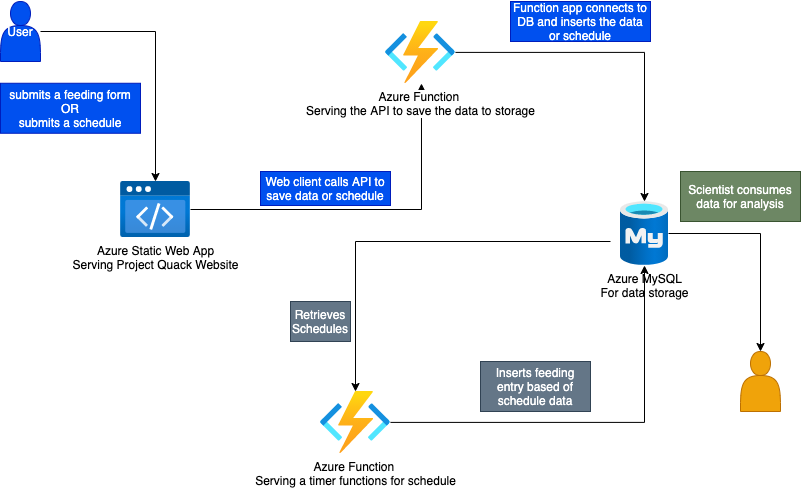
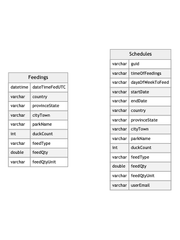

# About the Technologies Used
## Technology Stack Used
- Frontend
  - React served using Azure Static Web App
- Backend
  - Serverless using Azure Functions
- Data Storage
  - MySQL
  
 

## High Level Component Diagram

 

## Database Model

### Why React?
React is a very popular choice of javascript framework for front end web application development. It has lots of community support, so there are a number of resources and libraries out there to use. It is a very flexible framework that is easy to adapt and scale out.

I have been using React for a few years now and felt comfortable using it for this project.

 

### Why Azure Static Web App with Azure Functions?
Since this is a farely simple application, I wanted somewhere quick to setup CI/CD. They easily integrate with Github and create the pipeline with little effort. They come integrated with internal azure function capability. This allows the web application to have a quickly setup api.

I have played around a bit with Azure Static Web Apps when they were still in preview phase. Found it was a good chose to quickly get the application up and running.

 

### Why MySQL?
Since this application is crowdsourcing it's data and the users would likely be out in a park. It makes sense that it would one day have a mobile component. MySQL is one of the more familiar choices that I know of for mobile development. So this was chosen for the future uses of it.

I also chose it due to the fact that it could be easily setup on a mac for local development. 

 

### Why Microsoft Azure for Hosting?
I have not used Google Cloud, so I didn't want to spend a whole lot of time learning it. 

While I have used AWS, it has also been a couple years since I have been in it. So again I would need to learn not only how to deploy the application but the database and then integrate everything together. 

I use Microsoft Azure all the time at work and felt the most comfortable with the UI and features.